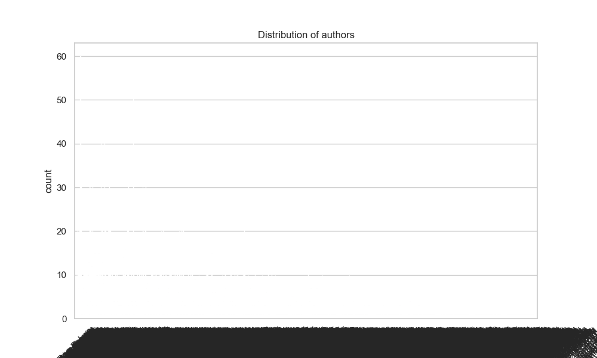
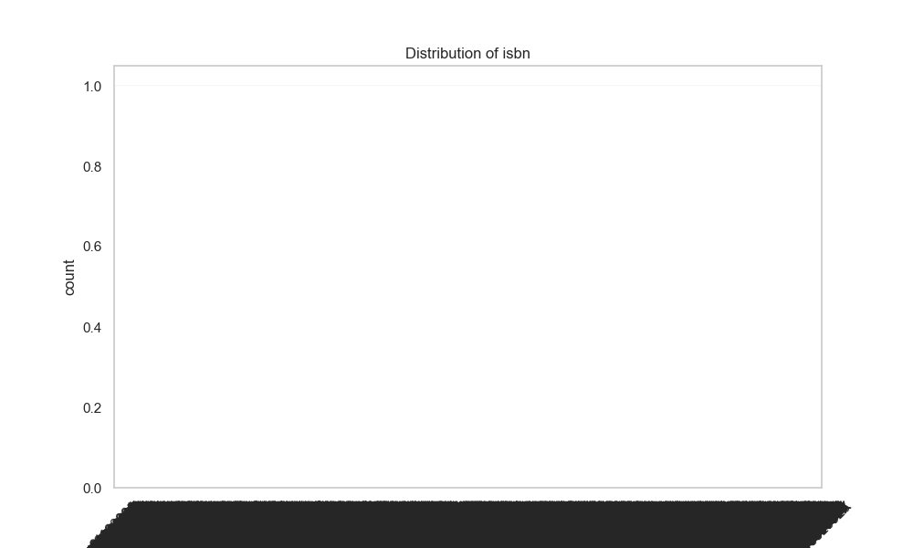

Based on the data analysis of the file `goodreads.csv`, we can generate several insights and observations about book ratings, authors, and publication dates that can serve as analytical directions for further exploration. Below is a detailed narrative based on the summary statistics, missing values, and correlation matrix:

### **Narrative Overview**

#### **1. Dataset Composition**
The dataset comprises 10,000 rows and 21 columns, representing various aspects of books listed on Goodreads. Key columns include `book_id`, `average_rating`, `ratings_count`, `work_ratings_count`, `authors`, and `original_publication_year`. The dataset covers a diverse set of books with a wide range of authors contributing to the uniqueness of the 'authors' column, which has 4,664 unique entries.

#### **2. Ratings Analysis**
- **Average Rating**: The mean average rating across all books is approximately 4.00, indicating generally positive reception by readers. Ratings are bounded between a minimum of 2.47 and a maximum of 4.82.
- **Ratings Distribution**: The ratings distribution across 1 to 5 indicates a notable lengthening tail where higher ratings (4 and 5) are significantly higher than lower ratings (1, 2, and 3). The mean ratings per category indicate a strong skew toward higher satisfaction levels.
  
- **Correlation Insights**: The correlations in the dataset reveal certain interesting relationships:
    - There is a negative correlation between `ratings_count` and `average_rating` (-0.373), suggesting that highly rated books may have fewer total ratings, possibly an indicator that they are niche titles.
    - Ratings specific to different categories (ratings_1 through ratings_5) exhibit a strong positive correlation with ratings count, particularly the highest ratings (rating_5 is 0.964).

#### **3. Authors and Popularity**
- The top author within the dataset is Stephen King, appearing on 60 entries. This observation suggests that key authors significantly contribute to the book count, pointing toward potential avenues for author-specific analysis. 
- Authors with a smaller number of total ratings could yield insights into emerging writers that may not have yet gained mainstream popularity.

#### **4. Publication Year Trends**
- Analysis of `original_publication_year` reveals a mean publication year of about 1982, with a significant number of entries published in the 2000s. This trend suggests a mix of classic and contemporary works, reflecting a preservation of historically significant literature alongside newer publications.
- The correlation between `original_publication_year` and `ratings_count` is slightly negative (-0.024), which may suggest newer books face more scrutiny or a changing landscape of reader preferences over time.

#### **5. Missing Values**
- Some columns exhibit missing values, particularly `isbn`, `isbn13`, `original_title`, and `language_code`. Addressing these gaps could provide deeper insights and improve the reliability of any further analytical models.
  
### **Suggested Analyses and Next Steps**
#### **1. Clustering**
- **Genre/Theme Clustering**: Implement clustering algorithms such as K-Means on the `average_rating`, `ratings_count`, and `work_ratings_count` to identify different categories of books based on reader satisfaction and interaction. This could help categorize books into high-quality, highly rated works versus less popular or average-rated titles.
  
#### **2. Anomaly Detection**
- **Outlier Rating Investigations**: Identify books with exceptionally high or low ratings demand an investigation into what factors contribute to these extremes. This could involve examining the ratings distribution for anomalies in counts or average ratings.
  
#### **3. Time Series Analysis**
- Analyze changes in `average_rating` over time, especially by grouping books by their publication year. This can highlight shifts in reading trends and reader preferences over decades.
  
#### **4. Sentiment Analysis on Reviews**
- Given that there are columns representing `work_text_reviews_count`, further analysis could involve leveraging text analysis on reviews to extract sentiment, which can be correlated with numerical ratings to understand if sentiment trends align consistently with the ratings.
  
#### **5. Author Network Analysis**
- Construct an author network based on collaborations or co-authored works, gleaning insights into social connections within the literary community on Goodreads. This could be beneficial in examining how collaborative writing impacts popularity and ratings.

#### **6. Language Analysis**
- With the `language_code` data, a comparative analysis on ratings by language could furnish insights into how different language speakers rate books differently, revealing cultural biases or preferences in literature.

### **Conclusion**
Overall, the data from `goodreads.csv` provides a wealth of information and insights into book ratings, authors, and publication trends. By employing advanced analytical techniques like clustering, anomaly detection, and time series analysis, additional patterns can be uncovered that deepen our understanding of reader behavior and preferences on the Goodreads platform.

