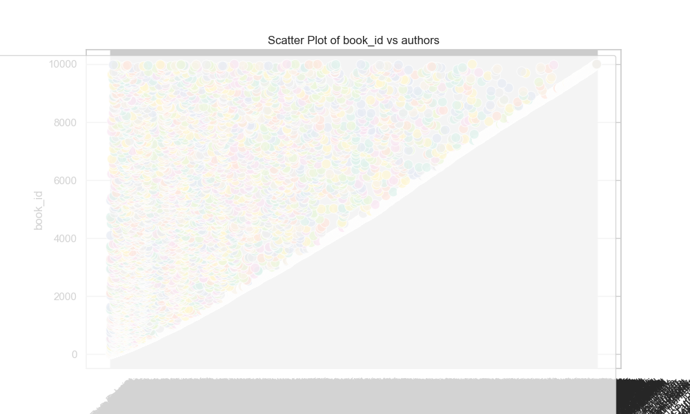
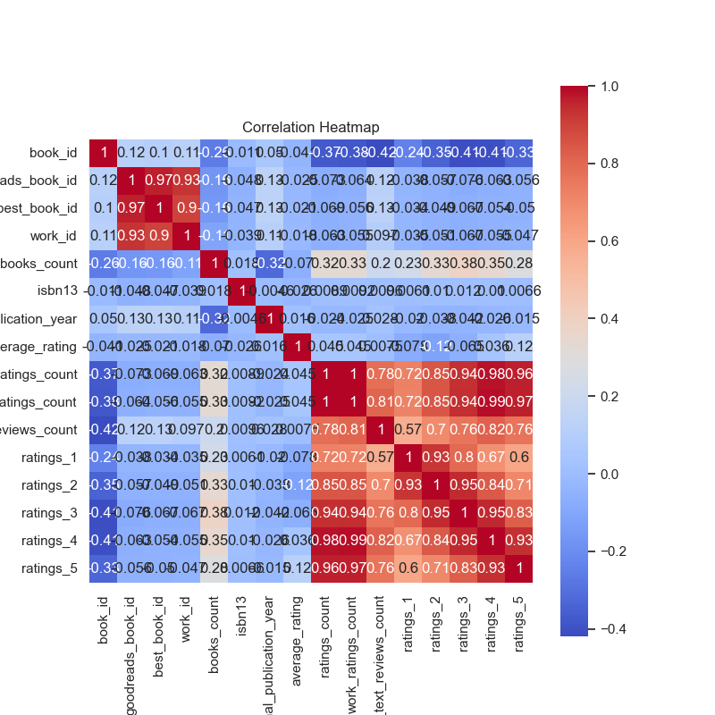
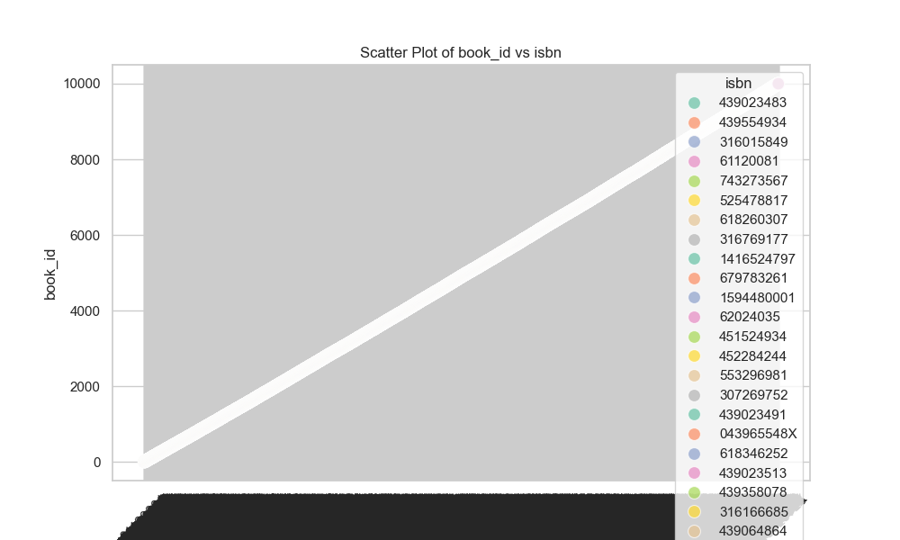

### Narrative Analysis of Goodreads Data

#### Overview
The analysis of the `goodreads.csv` dataset, which comprises 10,000 entries related to different books, reveals valuable insights into the behavior and preferences of readers as well as the characteristics of the books published. The dataset consists of various columns, including identifiers, authors, publication years, language, ratings, and more, which provide a comprehensive picture for further exploration. 

#### Key Findings

1. **Descriptive Statistics**:
   - The dataset features a diverse range of books with an average rating of approximately 4.00. The standard deviation (0.25) indicates relatively consistent ratings across the entries. The highest average rating recorded is 4.82, suggesting a pool of highly-regarded books.
   - Ratings are widely distributed, with a mean ratings count of about 54,001. However, the ratings count exhibits a high standard deviation of 157,370, revealing that certain books are extremely popular while others are not. The maximum ratings count is 4,780,653, indicating some books have garnered significant acclaim.
   - The language code column shows a notable dominance of English titles (63.4%), which provides a perspective on the popularity of English literature within the dataset.

2. **Publication Trends**:
   - The dataset includes books published as far back as 1750. The mean original publication year is around 1982. This suggests that while many older books are included, the majority of content is more contemporary, reinforcing a potential trend in favor of modern literature.
   - The range in the number of books per entry (up to 3,455 books) indicates a mixture of standalone novels and series.

3. **Missing Values**:
   - There are missing values across several columns, most notably in `isbn` (700 missing) and `isbn13` (585 missing). This could impact analyses focused on the identification and uniqueness of the publications.
   - Notably, the columns `original_title` and `language_code` also exhibit missing values, which could affect regional interpretations and the specificity of original works.

4. **Correlation Insights**:
   - A significant negative correlation exists between `ratings_count` and most rating categories (1 to 5), pointing to a trend where an increase in overall ratings corresponds with a decrease in low ratings (indicating higher overall book quality).
   - There is a robust positive correlation between `work_ratings_count` and each individual rating category, emphasizing that books with higher overall ratings also tend to have a higher frequency of favorable reviews.
   - Interestingly, `books_count` shows a significant negative correlation with `original_publication_year`, implying that older works tend to have fewer editions or terms.

#### Suggested Additional Analyses

1. **Clustering Analysis**:
   - Cluster analysis could be utilized to group books based on features such as `average_rating`, `ratings_count`, and `work_ratings_count`. This could reveal niche genres or specific thematic elements that constitute high- or low-rated books.
   - By incorporating `authors` data alongside numeric attributes, clusters could help identify prolific authors whose works tend to receive high ratings, versus those who produce numerous books but with lower ratings.

2. **Anomaly Detection**:
   - Conduct a thorough anomaly analysis to identify outlier books based on ratings and reviews. For instance, books with massive ratings counts but low average ratings should be investigated to understand what might have caused such a discrepancy (i.e., author reputation, marketing tactics, or timed releases).
   - A time-series anomaly detection could help in identifying trends leading to sudden spikes in ratings or reviews, potentially linked to film adaptations or anniversaries.

3. **Sentiment Analysis of Reviews**:
   - If review text data is available, conducting sentiment analysis of reader reviews could provide a qualitative complement to quantitative ratings, offering deeper insights into why certain books are rated more highly than others.
   - This could involve natural language processing techniques to discern positive, negative, and neutral sentiments, which could further enhance understanding of book reception among readers.

4. **Market Segmentation Analysis**:
   - Utilizing language codes and publication years, market segmentation can be performed to understand different demographic reader preferences across various cultures and genres, thereby tailoring marketing strategies effectively.

#### Conclusion
The `goodreads.csv` dataset offers a rich source of data that, when analyzed further, can provide significant insights into the literary landscape, reader preferences, and the dynamics of book popularity over time. By leveraging more advanced analytical techniques such as clustering and anomaly detection, deeper patterns can be unearthed, leading to a more informed understanding of the publishing world and enhancing strategic marketing decisions tailored to reader interests.

