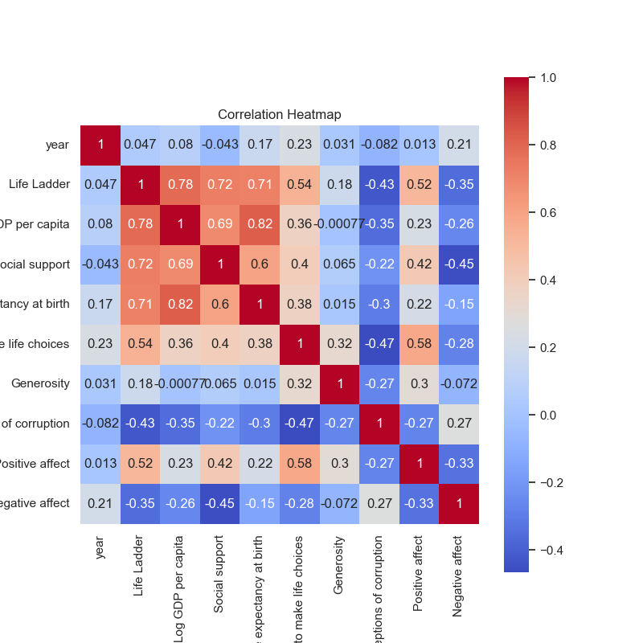
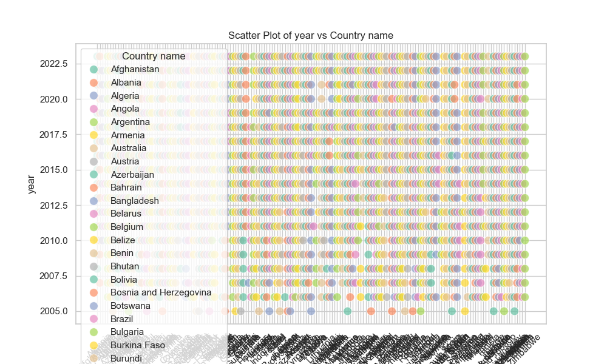

### Narrative Based on Happiness Data Analysis from 'happiness.csv'

#### Overview
The dataset 'happiness.csv' encompasses the varying metrics associated with happiness indices across different countries and years. It includes significant indicators such as the Life Ladder, GDP per capita, social support, and other components contributing to the perceived well-being of populations. The data comprises 2,363 records across 165 unique countries, making it valuable for understanding global happiness trends from 2005 to 2023.

#### Key Findings

1. **Descriptive Statistics**:
   - The **Life Ladder** mean stands at 5.48, indicating a moderate level of happiness among the global population. The scores range significantly from 1.28 to 8.02, suggesting considerable disparity in happiness levels globally.
   - **Log GDP per capita** averages around 9.40, with a minimum of 5.53, hinting that economic factors likely vary importantly across nations.
   - **Social Support**, on average, is relatively high at 0.81, indicating a beneficial social framework that may contribute to happiness. However, variations (0.23 to 0.99) indicate that not all populations have equal access to social networks.
   - The other indicators, such as **Healthy Life Expectancy** (mean of 63.4 years) and **Freedom to make life choices** (mean of 0.75), further provide layers to understanding individual well-being factors.

2. **Missing Values**:
   - Certain columns exhibit missing data: **Log GDP per capita** has 28 missing values, **Social support** has 13, and **Healthy life expectancy at birth** has 63. This missing data poses a challenge for complete analysis but also presents an opportunity for further data imputation techniques.
   - Notably, **Generosity** has 81 missing records, which could indicate regions where altruism is difficult to quantify or less prevalent, warranting closer examination.

3. **Correlation Analysis**:
   - High correlations were found among several variables. For instance, **Life Ladder** shows strong positive correlations with:
     - **Log GDP per capita** (0.78): Suggesting that higher economic prosperity corresponds significantly with increases in happiness.
     - **Social support** (0.72) and **Healthy life expectancy** (0.71) which imply that social networks and health outcomes are critical factors in perceived happiness.
   - Negative correlations with **Perceptions of corruption** (-0.43) and **Negative affect** (-0.35) highlight societal issues affecting happiness. This suggests that countries with higher corruption perceptions tend to have lower happiness levels.

4. **Temporal Analysis**:
   - The average dataset year suggests an inclination towards more recent measures, with a mean of approximately 2014. This temporal distribution can be delved into further to analyze trends over time in happiness indices per country, leading to identification of progressive or declining nations in terms of happiness.

### Insights and Trends

- **Economic Influence**: The strong correlation between GDP per capita and the Life Ladder indicates that economic health plays a pivotal role in shaping happiness. Policymakers might benefit from investing in economies to uplift overall happiness.
  
- **Social Connections Are Crucial**: The significant relationship between social support and happiness indicates that interventions reinforcing community and social networks could augment happiness levels significantly.

- **Addressing Corruption**: The negative correlation between perceived corruption and happiness suggests that governmental integrity is crucial. Efforts directed towards transparency and reducing corruption may foster happiness in populations.

### Suggested Additional Analyses

1. **Clustering Analysis**:
   - Consider implementing clustering algorithms (like KMeans or Hierarchical clustering) to categorize countries based on multi-dimensional happiness scores. Identifying clusters may unearth patterns allowing organizations to direct resources and programs toward countries needing intervention or support.

2. **Anomaly Detection**:
   - Anomaly detection could be employed to identify countries deviating significantly from expected happiness levels based on their GDP and social support. This would highlight nations that may require in-depth studies to understand unique circumstances.

3. **Time-Series Analysis**:
   - A longitudinal study through time-series analysis could unveil trends in happiness across years. By isolating variables like economic shifts, changes in social policies, or global phenomena (pandemics, conflicts), it may lend insights into the dynamics influencing happiness over time.

4. **Factor Analysis**:
   - Utilizing factor analysis could help in identifying underlying relationships between the observed variables, potentially simplifying and synthesizing the happiness drivers into primary factors that explain a larger variance in happiness among countries.

5. **Impact of Health Policies**:
   - Investigate the relationship between health policies and Healthy Life Expectancy versus the Life Ladder score. Are nations with better healthcare contributing to higher happiness scores compared to those with less effective health systems?

### Conclusion
The happiness dataset presents a rich tapestry of information that uncovers the complex interplay of economic, social, and psychological factors influencing happiness across nations. Through further detailed analyses, targeted interventions can be developed to enhance well-being globally.

