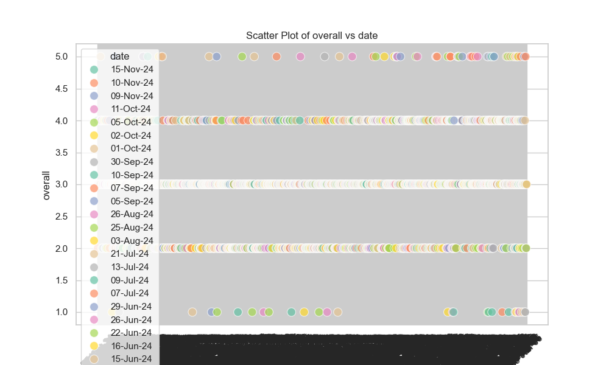
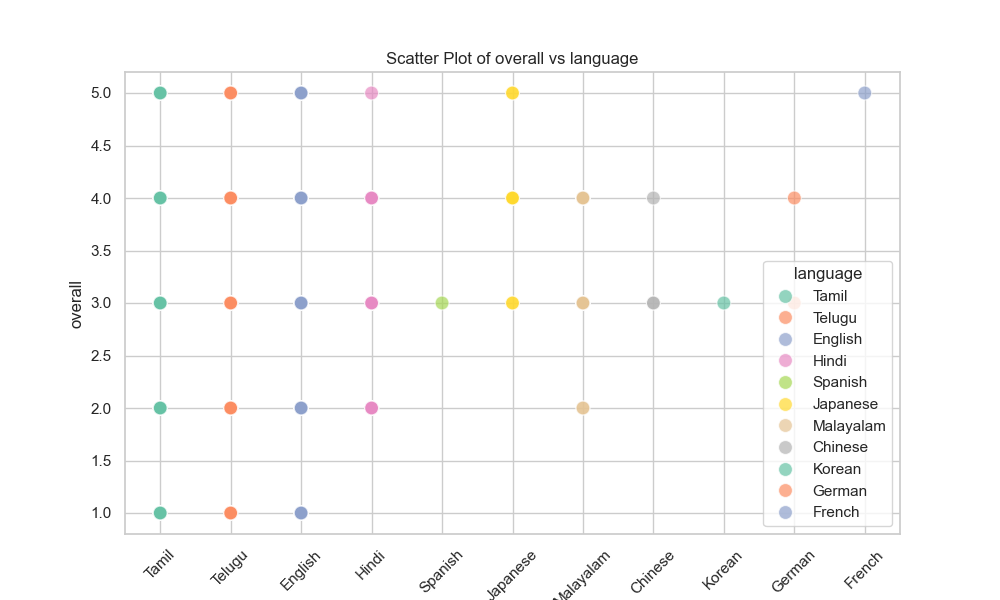

Based on the analysis of the dataset contained within the `media.csv` file, several significant insights, trends, and potential directions for additional analyses can be gleaned from the summary statistics, missing values, and correlation matrix. Below is a detailed narrative synthesizing these findings.

### General Overview

The dataset consists of 2,652 entries across various media forms, presumably reviews or ratings, as indicated by the columns such as 'title', 'overall', 'quality', and 'repeatability'. The columns capture metadata about the media, including the date of review, language, type, author, and several numerical ratings. 

### Key Insights

1. **Temporal Distribution**:
   - The dataset spans an extensive time range, but one of the entries emphasizes that '21-May-06' is the most frequently occurring date, with 8 records for that day. This indicates potential clustering or popularity spikes in reviews around specific dates. Further investigation into these dates might reveal trends correlating with media releases, events, or other calendar-related phenomena.

2. **Linguistic Diversity**:
   - The media entries are predominantly in English (1,306 records). However, the dataset includes 11 unique languages, which could provide insights into regional popularity and diversity. Understanding the demographics of the reviewers based on the language could help tailor marketing strategies or content development.

3. **Media Types**:
   - The category of 'type' shows a heavy bias towards movies, with 2,211 entries classified as such. Other types (7 remaining) could be analyzed for any emerging trends in ratings or repeatability. This might also indicate richer contexts for assessing what constitutes media quality across different formats (documentaries, series, etc.).

4. **Title Popularity**:
   - 'Kanda Naal Mudhal' stands out as the most reviewed title (9 times). Exploring why certain titles attract more reviews may reveal patterns based on genre, release year, or even promotional efforts. This could extend to an examination of whether these reviews correlate with higher ratings or repeatability.

5. **Reviewer Participation**:
   - There are 2,528 unique authors (1528 values for the 'by' column), but 262 entries are missing names. This could reflect inconsistent participation or anonymity in reviews, influencing the dataset's aggregation. Understanding who the reviewers are, their familiarity with the media types, and consistency in language could lead to insights into biases in ratings.

### Statistical Analysis

1. **Rating Distributions**:
   - The average ratings depict a predominantly positive perception with the following means: 
     - Overall Ratings: 3.05 (out of 5)
     - Quality Ratings: 3.21 (out of 5)
     - Repeatability Ratings: 1.49 (out of 3)

   The reflection of quality ratings being generally higher than overall ratings suggests that reviewers may differentiate between a media's inherent quality and their overall experience or satisfaction.

2. **Correlations**:
   - The correlation matrix indicates strong relationships:
     - Overall ratings and quality (r = 0.826): Suggests that higher perceived quality directly correlates with overall ratings.
     - Overall ratings and repeatability (r = 0.513): Indicates moderate correlation; as the overall ratings increase, repeatability may also be positively influenced.
     - Quality and repeatability (r = 0.312): This weaker correlation suggests that a high-quality rating does not necessarily imply that the media will be frequently revisited.

### Potential Future Analyses

1. **Clustering**:
   - Implement clustering techniques (e.g., K-means or hierarchical clustering) to segment media based on ratings (`overall`, `quality`, and `repeatability`). Clustering could identify groups of media with similar characteristics, which could inform marketing efforts and content recommendations.

2. **Anomaly Detection**:
   - The potential for anomalies might exist in the `date` and `by` fields, especially concerning patterns in review counts. Time-series analysis could flag outliers in review submissions, shedding light on unusual events (e.g., releases, trends).

3. **Sentiment Analysis**:
   - If the text from reviews is available, sentiment analysis could offer a deeper understanding of reviewers' feelings about specific titles, correlating qualitative data to the quantitative ratings.

4. **Temporal Analysis**:
   - Conduct a time-series analysis to determine trends over time. This analysis could highlight periods of increased review activity, correlating these dates with external variables like new releases, critical events, or promotional campaigns.

### Conclusion

The `media.csv` dataset presents a rich opportunity for deeper insights into media consumption patterns, user engagement, and qualitative perceptions of media quality. By leveraging statistical analyses, correlations, and advanced techniques like clustering and anomaly detection, we can uncover trends that might inform future media production, marketing strategies, and user outreach efforts.

