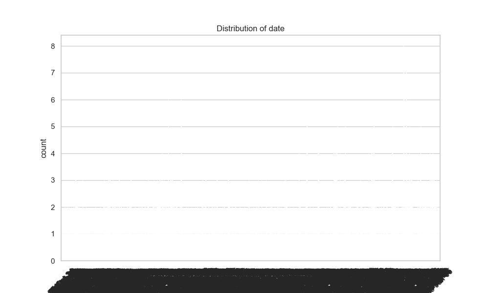
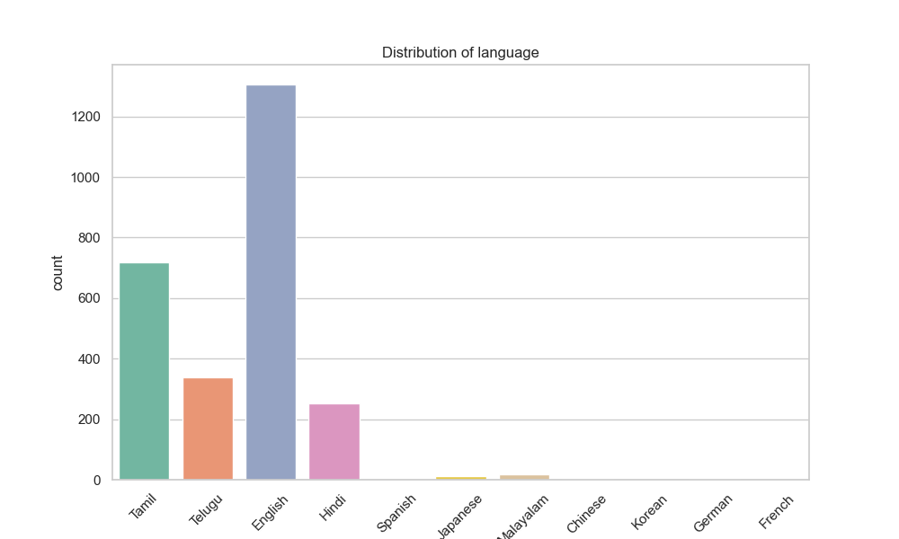

### Data Analysis Narrative for 'media.csv'

#### Overview
The data extracted from 'media.csv' contains pertinent information regarding various media entries, including movies or other forms of content, evaluated across several metrics. The dataset comprises 2,652 entries, with 99 instances missing date information and 262 entries lacking the contributor ('by') information. The analysis aims to summarize patterns related to language, type, title, overall ratings, quality, and repeatability of the media.

#### Key Insights

1. **Date Distribution**:
   - The dataset spans across several years, with a total of 2,053 unique dates recorded. The most frequently appearing date is '21-May-06', which has 8 occurrences. This indicates that certain dates may have been significant for media releases or evaluation.

2. **Language Proportions**:
   - The data is multilingual, with 11 unique languages present. However, English dominates the dataset, accounting for 1,306 occurrences (approximately 49% of total records). This suggests a strong bias toward English media content, and it might be worthwhile to investigate the representation of non-English entries.

3. **Type and Title Analysis**:
   - The predominant type of media is 'movie,' represented by 2,211 entries, which accounts for about 83.3% of the dataset. Additionally, there are 2,312 unique titles noted, with the title 'Kanda Naal Mudhal' being the most frequent at 9 occurrences.
   - Further examination of title distribution may provide insights into popular and recurrent themes or genres.

4. **Ratings Insights**:
   - The average scores for overall ratings and quality stand at 3.05 and 3.21 out of 5, respectively. This indicates a generally positive perception of the media content. Additionally, the mean repeatability score is 1.49, suggesting that the majority of media is not commonly repeated, which can inform strategies for recommendations or re-releases.
   - Looking into the distribution of ratings can help to identify biases in evaluations or areas in need of improvement.

5. **Correlation Insights**:
   - The correlation between overall ratings and quality ratings is strong (r = 0.83), implying that better quality typically corresponds to higher overall ratings. The repeatability score shows moderate correlation with overall ratings (r = 0.51), suggesting that media frequently rewatched or revisited is generally perceived more favorably.
   - The weak correlation between quality and repeatability (r = 0.31) indicates that a piece of media can be deemed high quality without necessarily being frequently repeated, pointing towards diverging factors affecting viewer behavior.

#### Missing Values Analysis
The dataset exhibits missing values only for the 'date' and 'by' columns:
- **Date**: 99 missing entries may hinder time-series analyses or trends over time.
- **By**: 262 entries lacking contributor information suggest potential gaps in data credibility or recognition of contributors, impeding deeper analyses on performance or reputation metrics tied to contributors.

### Suggested Additional Analyses

1. **Trends Over Time**:
   - **Time-Series Analysis**: Fill missing dates where possible and analyze trends in media ratings over time. Investigate if certain periods yield lower or higher ratings due to external influences like societal trends, technological advancements, or historical events.

2. **Sentiment Analysis on Titles**:
   - For qualitative insights, run a sentiment analysis on the titles or descriptions associated with the media. This could identify perceptions associated with specific titles or genres.

3. **Cluster Analysis for Audience Segmentation**:
   - Conduct clustering algorithms such as K-means or hierarchical clustering on the quality, overall ratings, and repeatability scores to identify segments of media that share characteristics. This can help in tailoring marketing strategies or recommendations.

4. **Anomaly Detection**:
   - Use statistical tests or machine learning models to detect outliers in the ratings data. Identifying media with significantly higher or lower ratings than expected can reveal influential content worth further investigation.

5. **Missing Value Treatment**:
   - Implement strategies for dealing with missing values. This might include imputation for the 'date' and 'by' columns or analysis on the impact of missing information and re-evaluation of metrics excluding incomplete cases.

6. **Engagement Metrics**:
   - Explore further dimensions by collecting additional data on viewer engagement (such as views, watch time, or user ratings) to enrich the analysis and provide holistic insights into media performance.

### Conclusion
This analysis provides a comprehensive view of the media dataset, revealing essential insights into language preference, media types, and rating patterns. The aforementioned suggestions for further analysis aim to deepen our understanding of media dynamics and consumer behavior while addressing potential gaps in the data.

